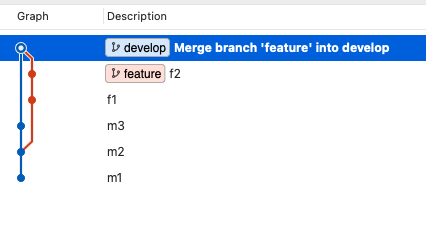

# Git Notes

## Concept of HEAD

HEAD refers to the most recent commit of the current branch you are seeing

### Detached HEAD

You can checkout to any commit in history by

```bash
$ git checkout 9ad202d538c6ee6448e2c1ecc080c292cc761771
```

In this case the hash refers to a specific commit, after that we are entering into a detached HEAD mode, where we can do changes and commits

To return to master just

```bash
$ git checkout master
```

## Reversing git commits

There are two ways to undo a commit:

- Undo a commit and put the files in the staging area

```bash
$ git reset --soft HEAD~1
```

- Undo the commit and permantly delete the files

```bash
$ git reset --hard HEAD~1
```

NOTE: the "HEAD~1" means that you are trying to position the HEAD 1 step behind in history

## Merge types

### Fast-forward

It moves the HEAD forward, but doesn't create a new commit. Only works if no additional commits were commited after a feature branch was created

```
$ git merge feature
```


Using squash merge will group all the changes in one commit, then put it on the master branch staging area for been commited after


### Non-Fast-Forward (recursive\*)

When merged it creates a new commit

```
$ git merge feature --no-ff
```


If there are new commits in the master branch after the feature branch creation, it will automatically use the non fast forward strategy.
In this example m3 is newer than the creation of the feature branch

```
$ git merge feature
```


